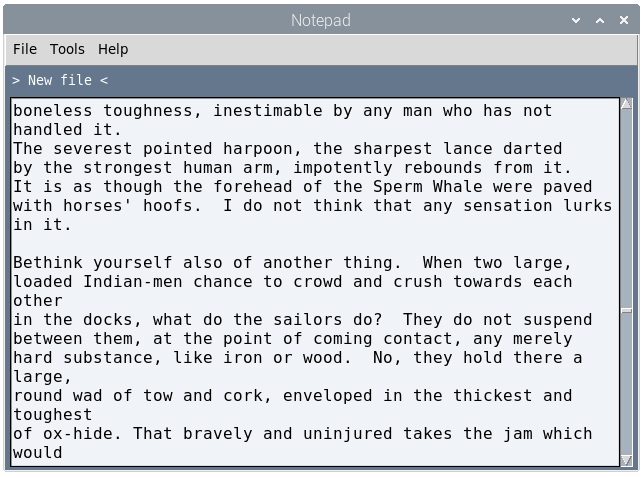
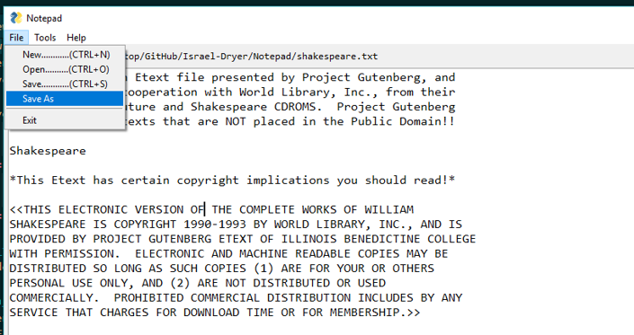
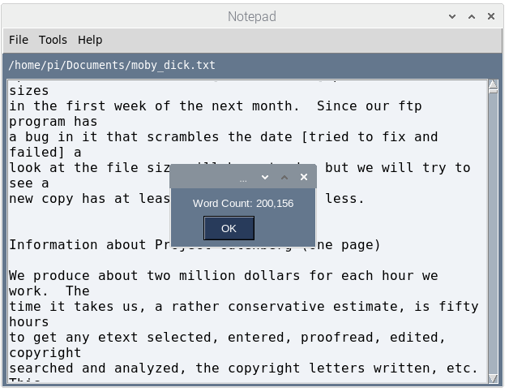
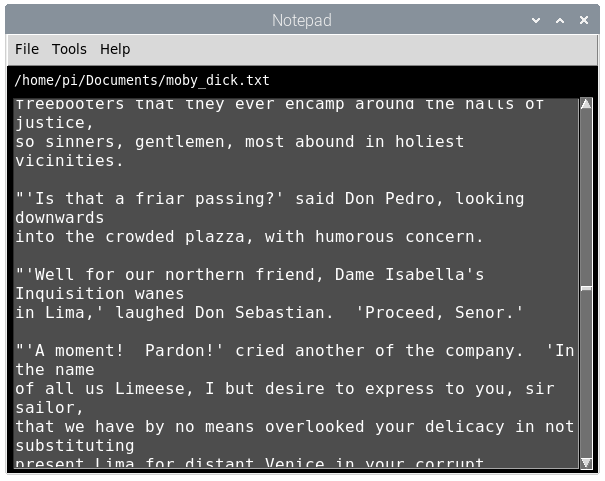

# Notepad
 A minimal notepad application designed with [PySimpleGUI](https://pysimplegui.readthedocs.io/en/latest/), but with a few bonus features. This is a great application to start out with if you want to build something useful and are looking for experience building out a GUI application. The great thing is that this is highly customizable as you can see from [another project](https://github.com/israel-dryer/Text-Code-Editor) that I'm working on.
 
 Check out the tutorial on [YouTube](https://youtu.be/JQY641uynKo)
 
 See a live demo on [Trinket](https://israel-dryer.trinket.io/sites/notepad)
 

Standard menu items with keyboard short-cuts

Includes a word-count function

Theme the application with a simple call to `sg.change_look_and_feel('Black')`... as an example. There are many built-in themes with [PySimpleGUI](https://pysimplegui.readthedocs.io/en/latest/).

